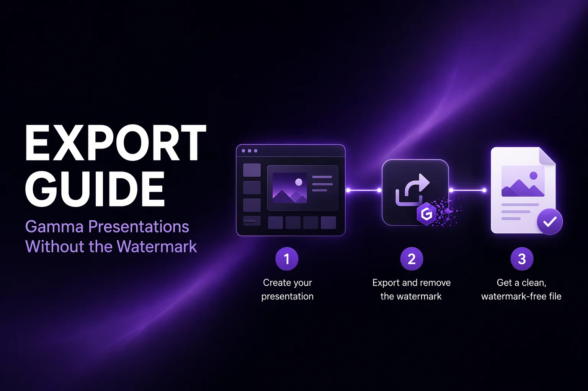

# Gamma Export Guide — Export Presentations Without the Watermark



A practical, regularly updated guide to exporting presentations from [Gamma.app](https://gamma.app): what each export format contains, why the "Made with Gamma" watermark appears, and every working way to get clean PDF and PowerPoint files.

Maintained by the [GammaRemover](https://gammaremover.com) project. Corrections and additions are welcome via pull request.

## Contents

- [How Gamma exports work](#how-gamma-exports-work)
- [How to export Gamma presentations without a watermark](#how-to-export-gamma-presentations-without-a-watermark)
- [How to remove the Made with Gamma watermark from PDF](#how-to-remove-the-made-with-gamma-watermark-from-pdf)
- [How to remove the Made with Gamma watermark from PPTX](#how-to-remove-the-made-with-gamma-watermark-from-pptx)
- [Free plan limits you should know](#free-plan-limits-you-should-know)
- [Method comparison](#method-comparison)
- [Related tools](#related-tools)

## How Gamma exports work

Gamma offers three ways to share a deck: a live web link, a PDF export, and a PowerPoint (.pptx) export. On the free plan, all three carry "Made with Gamma" branding:

1. **Web links** show a badge in the corner of the viewer. This badge is served by Gamma and cannot be modified.
2. **PDF exports** print the badge onto every page — a small image in the bottom-right corner plus a clickable link to gamma.app.
3. **PPTX exports** embed the badge as a hyperlinked shape on the slide master, which is why it appears on every slide.

The important detail: in the exported files, the watermark is a **separate document object**, not part of your content. That is what makes clean, lossless removal possible.

## How to export Gamma presentations without a watermark

You have three honest options:

**Option 1 — Upgrade to a paid plan.** Gamma Plus (around $10/month) removes the watermark from all *new* exports and lifts the credit cap. Note that upgrading does not clean files you already exported, and decks created in a free workspace can keep showing the badge on their shared link until copied into the paid workspace. Details: [Does Gamma Plus remove the watermark?](https://gammaremover.com/en/blog/does-gamma-plus-remove-watermark/)

**Option 2 — Export normally, then clean the file.** Since the badge is a discrete object, it can be deleted from the exported file without touching anything else. The fastest way is [gammaremover.com](https://gammaremover.com) — free, runs in your browser, no upload. Command-line users can `pip install gamma-watermark-remover` ([repository](https://github.com/gammaremover/gamma-watermark-remover)).

**Option 3 — Rebuild in a watermark-free tool.** Google Slides and Canva add no export branding on their free tiers. Practical only if you have not invested in Gamma-specific design yet.

## How to remove the Made with Gamma watermark from PDF

The PDF badge consists of two objects on each page: an image drawn in the bottom-right corner, and a link annotation whose URI points to gamma.app.

**Browser (fastest):**

1. Open [gammaremover.com/en/pdf/](https://gammaremover.com/en/pdf/)
2. Drop in the exported PDF
3. The engine deletes the badge image and its link from every page, then reports what was removed
4. Preview the cleaned pages and download

**Command line:**

```bash
pipx install gamma-watermark-remover
gamma-watermark-remover deck.pdf
# → deck-no-watermark.pdf
```

Both routes are structural: text stays selectable, nothing is re-rendered. If an export flattened the badge into the page image (rare), the tools report that a watermark may remain rather than degrading your file.

## How to remove the Made with Gamma watermark from PPTX

Gamma stores the PPTX badge on the **slide layouts and masters**, so deleting it once removes it from every slide.

**Browser:** [gammaremover.com/en/pptx/](https://gammaremover.com/en/pptx/) — drop the .pptx, download the cleaned copy. Slides remain fully editable in PowerPoint, Google Slides, and Keynote.

**Command line:** `gamma-watermark-remover deck.pptx`

**Manually in PowerPoint:** View → Slide Master → find the "Made with Gamma" element on the master or layouts → delete → close Master view → save. Free and lossless, but the badge sometimes sits on several layouts, so check them all.

Avoid importing into Canva or Google Slides just to delete the badge — the format conversion frequently shifts fonts and spacing, and if the badge sits on the master you will be deleting it slide by slide.

## Free plan limits you should know

- **400 lifetime AI credits** — they do not refresh monthly. A full generated deck costs about 40 credits; most users exhaust the allowance within 10 full decks with edits.
- **Watermark on all exports** — web, PDF, and PPTX.
- **No custom fonts or brand kit** on the free tier.

Full breakdown: [Gamma free plan limits in 2026](https://gammaremover.com/en/blog/gamma-free-plan-limits-2026/)

## Method comparison

| Method | Time | Quality | Privacy | Cost |
|--------|------|---------|---------|------|
| Browser cleanup (gammaremover.com) | Seconds | Lossless | In-browser, no upload | Free |
| CLI (gamma-watermark-remover) | Seconds | Lossless | Local | Free |
| PowerPoint Slide Master edit | Minutes | Lossless | Local | Free, PPTX only |
| Canva / Google Slides import | 10+ min | Layout may shift | Uploaded to platform | Free |
| Screenshots | Hours | Text not selectable | Local | Free |
| Gamma Plus | — | Clean new exports | — | ~$120/year |

## Related tools

- **Web app** (browser, no upload): [gammaremover.com](https://gammaremover.com)
- **CLI + Python library**: [gamma-watermark-remover](https://github.com/gammaremover/gamma-watermark-remover)
- **Local web UI**: [gamma-watermark-remover-webui](https://github.com/gammaremover/gamma-watermark-remover-webui)
- **MCP server** for Claude and AI agents: [gamma-watermark-remover-mcp](https://github.com/gammaremover/gamma-watermark-remover-mcp)
- **Agent skill** for Claude Code and OpenClaw: [gamma-watermark-remover-skill](https://github.com/gammaremover/gamma-watermark-remover-skill)
- **Curated Gamma resources**: [awesome-gamma](https://github.com/gammaremover/awesome-gamma)

## Responsible use

These guides cover files you created and exported yourself. Keep your originals, review cleaned files before sharing, and if you rely on Gamma heavily, [the paid plan may genuinely be worth it](https://gammaremover.com/en/blog/gamma-free-vs-pro-watermark/) for the unlimited credits alone.

## License

[CC0](LICENSE) — public domain.
